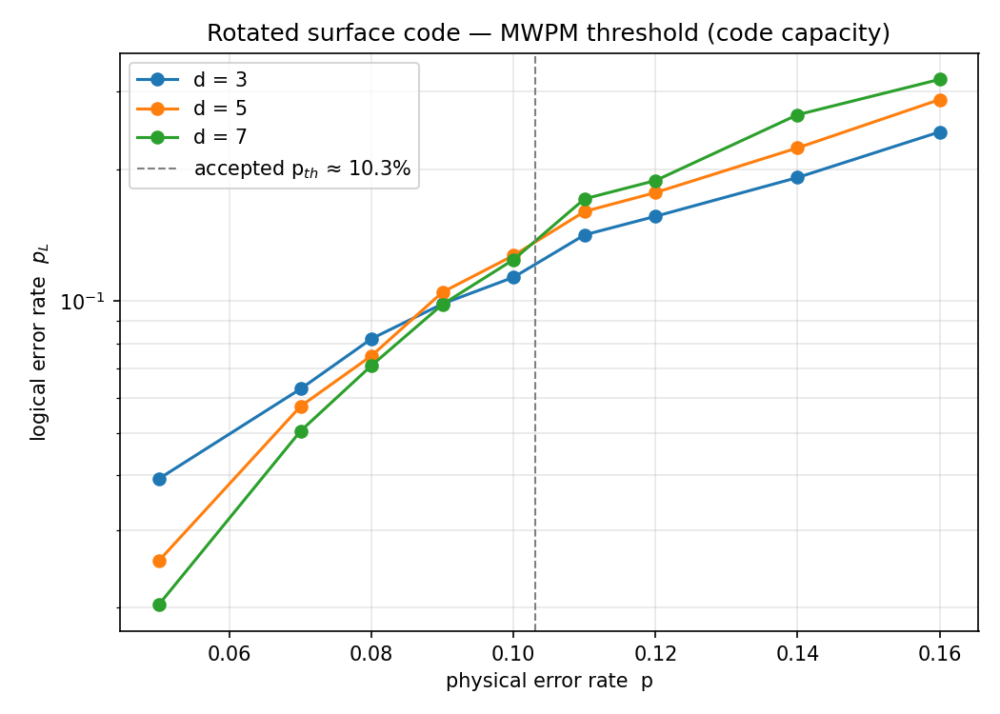

# Surface-Code MWPM Decoder (from scratch)

A self-contained implementation of a **minimum-weight perfect matching (MWPM)
decoder** for the rotated surface code, with a Monte-Carlo threshold study. No
QEC or matching libraries (no Stim, PyMatching, NetworkX, or SciPy) — the code
construction, the matching algorithm, and the logical-error bookkeeping are all
written by hand, to demonstrate the underlying theory rather than call it.

Dependencies: `numpy`, `matplotlib` only.

## What it does

Under the **code-capacity** noise model (each data qubit suffers an
independent X error with probability `p`, syndrome measured perfectly), the
decoder:

1. builds the Z-type stabilizers of a distance-`d` rotated surface code;
2. computes the **syndrome** (which stabilizers are lit);
3. forms the **defect graph** — defects are lit stabilizers, edge weights are
   the shortest number of physical errors linking them (BFS on the error graph,
   with the code boundary as a matchable target);
4. solves **minimum-weight perfect matching exactly** to pair defects / send
   them to the boundary;
5. applies the resulting **correction** and tests for a **logical failure**
   using a homological cut (the coboundary of a boundary region).

## Files

| File | Contents |
|------|----------|
| `mwpm.py` | Exact minimum-weight perfect matching via an `O(2^n·n)` bitmask DP, with a greedy fallback above a defect cap. Unit-tested against brute force (`_self_test`). |
| `surface_code.py` | Rotated surface-code construction, error graph, BFS, decoding, and logical check. `self_test()` validates stabilizer counts, single-error syndromes, and logical operators. |
| `repetition_code.py` | 1D repetition-code decoder — the exact-matching warm-up; crosses at `p = 0.5` as expected. |
| `run_threshold.py` | Monte-Carlo sweep over `p` and `d`; writes `threshold.png` and `threshold.csv`. |

## Results



Curves for different code distances cross at the **threshold** `p_th`: below it,
larger codes suppress logical errors; above it, they amplify them. The measured
crossing sits near the accepted code-capacity value of **~10%** (`~10.3%` for
ideal MWPM). Small-distance finite-size effects shift the apparent crossing
slightly; it sharpens as `d` grows and shot counts increase.

## Correctness

Every component is self-checked before use:

- **Matching** — the DP matcher is validated against exhaustive brute force on
  hundreds of random instances.
- **Code** — stabilizer count equals `(d² − 1)/2`; every single-qubit error
  lights 1–2 stabilizers; a straight qubit chain across the lattice is confirmed
  to be a weight-`d` logical operator (empty syndrome, odd overlap with the
  observable cut).
- **Harness** — the repetition code reproduces its known `p = 0.5` threshold,
  confirming the Monte-Carlo and logical bookkeeping before the 2D numbers are
  trusted.

## Run it

```bash
python3 mwpm.py            # matching self-test
python3 surface_code.py    # code self-tests for d = 3, 5, 7
python3 repetition_code.py # 1D sanity check (threshold at p = 0.5)
python3 run_threshold.py   # full sweep -> threshold.png, threshold.csv
```

## Next steps

The natural extensions map onto production QEC research:

- **Circuit-level noise** and a phenomenological/3D matching graph over multiple
  measurement rounds (measurement errors as time-like edges).
- **Correlated (depolarizing) decoding** that couples the X and Z sectors.
- **Weighted edges** from a calibrated error model (log-likelihood weights).
- Benchmarking this hand-written decoder against **Stim + PyMatching** for
  cross-validation and speed.
